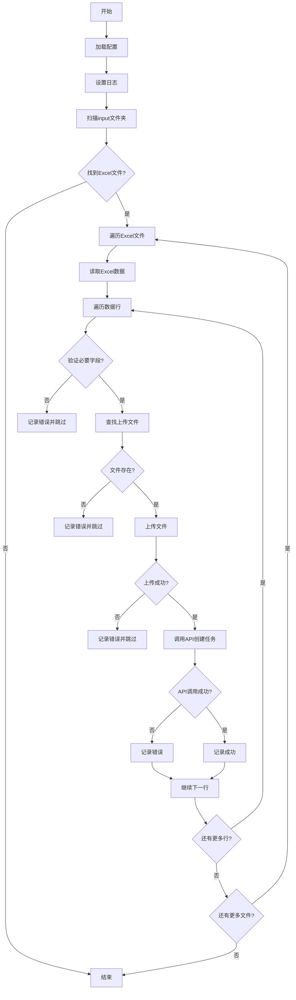

# 批量测试数据脚本完整设计

## 脚本概述

这是一个用于批量处理测试数据的Python脚本，它会：
1. 读取input文件夹中的Excel文件
2. 逐行处理数据
3. 根据每行数据从file文件夹中选择文件进行上传
4. 调用API创建任务

## 脚本结构

```
batch_test_runner.py
├── main()                      # 主函数
├── load_config()               # 加载配置
├── process_input_files()       # 处理输入文件
├── read_excel_data()           # 读取Excel数据
├── process_row()               # 处理单行数据
├── upload_file()               # 上传文件
├── create_agent_task()         # 创建代理任务
├── get_auth_token()            # 获取认证令牌
└── setup_logging()             # 设置日志
```

## 依赖库

```python
import os
import sys
import json
import logging
import argparse
from pathlib import Path

import pandas as pd
import requests
```

## 配置文件

### config.ini
```ini
[api]
url = https://192.168.0.130:8090/prod-api/sse/agent/ppt/agent-task/create
timeout = 30

[directories]
input = input
file = file
log = logs

[auth]
token_env_var = API_TOKEN
```

## 命令行参数

```bash
python batch_test_runner.py [--token TOKEN] [--input INPUT] [--file FILE]
```

## 核心算法流程



## 主要函数实现

### main()
```python
def main():
    """主函数"""
    # 解析命令行参数
    args = parse_args()
    
    # 加载配置
    config = load_config()
    
    # 设置日志
    setup_logging(config)
    
    # 获取认证令牌
    token = get_auth_token(args.token)
    
    # 处理输入文件
    process_input_files(config, token)
```

### process_input_files()
```python
def process_input_files(config, token):
    """处理输入文件"""
    input_dir = config['directories']['input']
    
    # 扫描Excel文件
    excel_files = scan_excel_files(input_dir)
    
    for file_path in excel_files:
        logger.info(f"处理Excel文件: {file_path}")
        
        # 读取数据
        data_rows = read_excel_data(file_path)
        
        # 处理每一行
        for index, row in enumerate(data_rows):
            process_row(row, index, config, token)
```

### process_row()
```python
def process_row(row_data, row_index, config, token):
    """处理单行数据"""
    logger.info(f"处理第{row_index+1}行数据: {row_data.get('task_name', 'Unknown')}")
    
    # 验证必要字段
    if not validate_required_fields(row_data):
        logger.error(f"第{row_index+1}行缺少必要字段")
        return
    
    # 查找文件
    file_path = find_file_in_folder(row_data['file_name'], config['directories']['file'])
    if not file_path:
        logger.error(f"文件 {row_data['file_name']} 未找到")
        return
    
    # 上传文件并创建任务
    try:
        result = upload_file_and_create_task(file_path, row_data, config, token)
        logger.info(f"任务创建成功: {result}")
    except Exception as e:
        logger.error(f"处理第{row_index+1}行时出错: {str(e)}")
```

## 错误处理和重试

```python
@retry_on_failure(max_retries=3, delay=1)
def upload_file_and_create_task(file_path, row_data, config, token):
    """上传文件并创建任务（带重试）"""
    # 上传文件
    upload_result = upload_file(file_path, config, token)
    
    # 移除file_name字段，因为它是本地文件标识，不需要发送给API
    api_params = {k: v for k, v in row_data.items() if k != 'file_name'}
    
    # 创建任务
    task_result = create_agent_task(api_params, upload_result, config, token)
    
    return task_result
```

## 使用示例

### 准备工作
1. 创建input和file文件夹
2. 将Excel测试数据放入input文件夹
3. 将待上传文件放入file文件夹

### 运行脚本
```bash
# 使用环境变量中的Token
export API_TOKEN="your_bearer_token_here"
python batch_test_runner.py

# 或者通过命令行参数指定Token
python batch_test_runner.py --token your_bearer_token_here
```

## 输出示例

```
2023-05-15 10:30:15,123 - INFO - 开始批量处理测试数据
2023-05-15 10:30:15,456 - INFO - 处理Excel文件: input/sample_data.xlsx
2023-05-15 10:30:15,789 - INFO - 处理第1行数据: 任务1
2023-05-15 10:30:16,123 - INFO - 文件上传成功: document.pdf
2023-05-15 10:30:17,456 - INFO - 任务创建成功: taskId=12345
2023-05-15 10:30:18,789 - INFO - 处理第2行数据: 任务2
2023-05-15 10:30:19,123 - ERROR - 文件image.jpg不存在于file文件夹中
2023-05-15 10:30:20,456 - INFO - 批量处理完成: 成功2项，失败1项